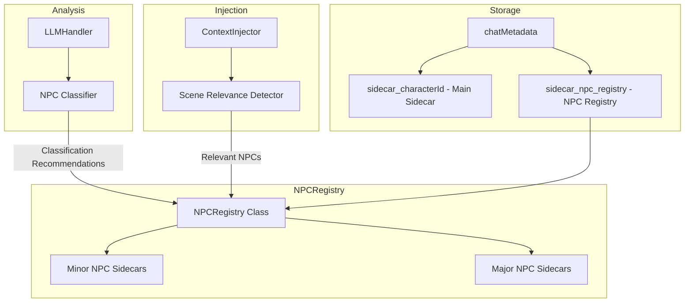
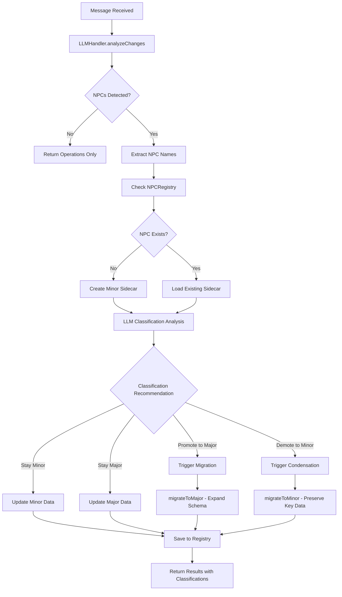

# NPC Tracking System - Implementation Plan

## Overview

This plan details the implementation of an enhanced LLM handler system that extends character card processing to track and manage all NPCs individually with a dynamic major/minor classification system.

## Architecture Summary

### Current State
- Single character sidecar tracking via [`SidecarManager`](lib/sidecar-manager.js)
- NPCs only tracked as relationship entries within main character's sidecar
- No individual NPC state persistence
- No classification or context-aware injection

### Target State
- Separate NPC Registry with individual sidecars for each NPC
- Two-tier sidecar system: lightweight minor NPCs, comprehensive major NPCs
- LLM-driven classification with user override capability
- Scene-aware NPC context injection
- Automatic migration between classification tiers

## System Architecture



## Data Schemas

### Minor NPC Schema
Lightweight tracking for background characters:

```javascript
const MINOR_NPC_SCHEMA = {
    meta: {
        npcId: '',
        name: '',
        classification: 'minor',
        firstAppearance: '', // ISO timestamp
        lastSeen: '',        // ISO timestamp  
        appearanceCount: 0,
        userPinned: false    // Prevents auto-downgrade
    },
    data: {
        notes: '',           // Brief description/role
        sentiment: '',       // Relationship to main character
        lastContext: ''      // Last interaction summary
    }
};
```

### Major NPC Schema
Full tracking matching main character depth:

```javascript
const MAJOR_NPC_SCHEMA = {
    meta: {
        npcId: '',
        name: '',
        classification: 'major',
        firstAppearance: '',
        lastSeen: '',
        appearanceCount: 0,
        userPinned: false,
        promotedFrom: null,  // Tracks if upgraded from minor
        promotionReason: ''
    },
    trackers: {
        status: {
            health: 'Healthy',
            energy: 'Normal', 
            mood: 'Neutral',
            conditions: []
        },
        appearance: {
            clothing: '',
            physical: ''
        },
        inventory: {
            equipped: { mainHand: 'Empty', offHand: 'Empty' },
            bag: []
        },
        personality: {
            traits: [],
            goals: [],
            fears: [],
            motivations: ''
        },
        relationships: {},      // Their relationships with others
        knowledge: []           // What this NPC knows
    },
    timeline: [],              // This NPCs event history
    narrativeRole: {
        archetype: '',         // Mentor, Antagonist, Love Interest, etc.
        storyFunction: '',     // Current narrative purpose
        conflictsWith: [],     // Characters they oppose
        alliedWith: []         // Characters they support
    }
};
```

### NPC Registry Schema
Container for all NPCs in a chat:

```javascript
const NPC_REGISTRY_SCHEMA = {
    meta: {
        version: '1.0',
        lastUpdated: '',
        totalNPCs: 0,
        majorCount: 0,
        minorCount: 0
    },
    npcs: {
        // Keyed by npcId
        // 'npc_merchant_bob': { ...MINOR_NPC_SCHEMA or MAJOR_NPC_SCHEMA }
    },
    sceneContext: {
        currentScene: '',
        activeNPCs: [],        // NPCs present in current scene
        recentlyMentioned: []  // NPCs mentioned in last N messages
    }
};
```

## Classification Flow



## LLM Model Strategy

**Decision: Cheap Model Only (Option A)**

NPC detection and classification will happen during normal `analyzeChanges()` calls using the configured cheap/updater model. This approach:
- Runs automatically with each analysis pass (no separate LLM calls needed)
- Lower cost per operation
- Classification is done as part of the existing extraction prompt
- Leverages the existing message event triggers

The Architect model is **not** used for NPC classification. Instead, the cheap model handles all NPC work during its regular analysis pass by extending the EXTRACTION_SYSTEM_PROMPT with NPC-specific instructions.

## LLM Prompt Extensions

### Extended EXTRACTION_SYSTEM_PROMPT additions:

```
NPC Classification Instructions:
For each NPC mentioned in the story, evaluate their narrative significance:

MINOR NPCs are:
- Background characters with minimal dialogue
- Mentioned but not actively participating
- Functional roles like shopkeepers without personality development
- One-time encounter characters

MAJOR NPCs are:
- Characters with recurring significant interactions
- Those with developed personalities or backstories
- Active antagonists or allies
- Characters with emotional significance to the protagonist
- Anyone whose goals/motivations drive plot threads

Output Format Extension:
{
  ...existing format...,
  "npcClassifications": [
    {
      "name": "NPC Name",
      "currentClassification": "minor|major|new",
      "recommendedClassification": "minor|major",
      "reasoning": "Brief explanation",
      "sceneRelevant": true/false,
      "updates": {
        // Delta operations specific to this NPC
      }
    }
  ]
}
```

## Implementation Phases

### Phase 1: Core Infrastructure
1. Create [`lib/npc-registry.js`](lib/npc-registry.js) with NPCRegistry class
2. Define MINOR_NPC_SCHEMA and MAJOR_NPC_SCHEMA constants
3. Implement storage/retrieval via chatMetadata
4. Add basic CRUD operations for NPC sidecars

### Phase 2: Classification System
5. Create [`lib/npc-classifier.js`](lib/npc-classifier.js)
6. Implement migrateToMajor and migrateToMinor functions
7. Add classification reasoning storage
8. Implement user override capability

### Phase 3: LLM Integration
9. Extend EXTRACTION_SYSTEM_PROMPT in [`lib/llm-handler.js`](lib/llm-handler.js:7)
10. Update DELTA_OPERATIONS_SCHEMA for NPC classifications
11. Modify [`analyzeChanges()`](lib/llm-handler.js:371) to process NPC data
12. Add scene-relevance detection logic

### Phase 4: Context Injection
13. Update [`ContextInjector`](lib/context-injector.js) with formatNPCContext method
14. Implement scene-aware NPC selection
15. Add injection depth configuration
16. Update [`inject()`](lib/context-injector.js:213) method

### Phase 5: UI Updates
17. Extend [`CharacterPanel`](lib/ui-popup.js:431) with NPC registry view
18. Add classification badge indicators
19. Create promote/demote action buttons
20. Add NPC detail view modal
21. Update settings panel for NPC preferences

### Phase 6: Integration & Testing
22. Update [`index.js`](index.js) to initialize NPCRegistry
23. Wire up event handlers for NPC updates
24. Add NPC tracking settings to defaultSettings
25. Test migration edge cases

## File Changes Summary

| File | Changes |
|------|---------|
| `lib/npc-registry.js` | NEW - NPCRegistry class and schema definitions |
| `lib/npc-classifier.js` | NEW - Classification logic and migration utilities |
| `lib/llm-handler.js` | Extend prompts, add NPC classification output processing |
| `lib/sidecar-manager.js` | Add NPCRegistry integration, export schemas |
| `lib/context-injector.js` | Add NPC context formatting and scene-aware injection |
| `lib/ui-popup.js` | Extend CharacterPanel for NPC management |
| `index.js` | Initialize NPCRegistry, wire up handlers |
| `settings.html` | Add NPC tracking configuration options |
| `style.css` | Add styles for NPC indicators and views |

## Settings Additions

```javascript
const npcSettingsDefaults = {
    trackNPCs: true,
    autoClassify: true,
    injectNPCContext: true,
    maxNPCsInContext: 5,          // Limit NPCs injected per prompt
    minorRetentionDays: 30,       // Auto-cleanup for inactive minor NPCs
    majorPromotionThreshold: 3,   // Appearances before considering promotion
    includeMinorInContext: false  // Whether to inject minor NPCs
};
```

## Migration Logic

### Minor → Major Promotion
```javascript
function migrateToMajor(minorSidecar) {
    return {
        meta: {
            ...minorSidecar.meta,
            classification: 'major',
            promotedFrom: 'minor',
            promotionReason: 'LLM-assessed narrative significance'
        },
        trackers: {
            status: { health: 'Unknown', energy: 'Unknown', mood: 'Unknown', conditions: [] },
            appearance: { clothing: '', physical: '' },
            inventory: { equipped: { mainHand: 'Unknown', offHand: 'Unknown' }, bag: [] },
            personality: { traits: [], goals: [], fears: [], motivations: '' },
            relationships: {},
            knowledge: []
        },
        // Preserve existing notes as initial knowledge
        timeline: [{
            event: `First tracked: ${minorSidecar.data.notes}`,
            timestamp: minorSidecar.meta.firstAppearance
        }],
        narrativeRole: {
            archetype: '',
            storyFunction: '',
            conflictsWith: [],
            alliedWith: []
        }
    };
}
```

### Major → Minor Demotion
```javascript
function migrateToMinor(majorSidecar) {
    // Condense important info into notes
    const condensedNotes = [
        majorSidecar.trackers.personality?.motivations,
        majorSidecar.narrativeRole?.storyFunction,
        majorSidecar.timeline?.slice(-1)[0]?.event
    ].filter(Boolean).join('. ');
    
    return {
        meta: {
            ...majorSidecar.meta,
            classification: 'minor',
            demotedFrom: 'major'
        },
        data: {
            notes: condensedNotes || majorSidecar.meta.name,
            sentiment: majorSidecar.trackers.relationships?.mainCharacter?.sentiment || 'Neutral',
            lastContext: majorSidecar.timeline?.slice(-1)[0]?.event || ''
        }
    };
}
```

## Success Criteria

1. NPCs are automatically detected and tracked during story analysis
2. Classification is LLM-driven with visible reasoning
3. Users can manually override classifications via UI
4. Major NPCs receive full character-like tracking
5. Minor NPCs maintain lightweight footprint
6. Context injection only includes scene-relevant NPCs
7. Migration preserves essential data in both directions
8. UI clearly distinguishes major vs minor NPCs
9. Settings allow fine-tuning of NPC behavior
